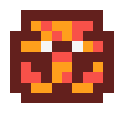

# Pullhatch — Poke-issue-dex №3

*The Fault Pokémon*

**Type:** bug

**Rank:** medium

**Species:** Fault Pokémon  
**Height:** 0.9 m   **Weight:** 20.0 kg

> Pullhatch is the Fault Pokémon: it hatches the titleless eggs that assigned pull requests leave scattered across Region Safari's Needs-attention lane. Today the board surfaces assigned PRs via `gh search prs`, but the enrich pass resolves every card with `gh issue view <num>` — which fails on a PR number — so each PR renders as a bare, nameless #num egg with no title hint or link. Pullhatch teaches the enrich path to recognize a PR: it carries each item's kind (issue vs pr) end-to-end from backlog.mjs into enrichment and reaches for `gh pr view <num>` when the item is a pull request (or when the issue lookup fails), so PRs finally hatch into fully-titled, linked creatures instead of blank shells. Strictly read-only, it never mutates a thing it inspects.
